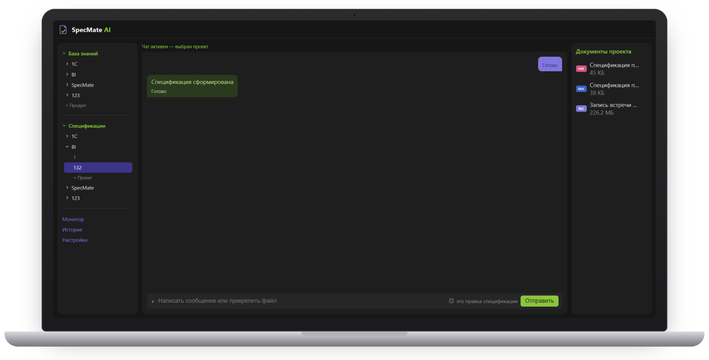

# SpecMate AI — ТЗ по записи встречи с клиентом

**Локальный AI-агент для presale- и PM-команд.** По аудио- или видеозаписи встречи с клиентом и заметкам менеджера SpecMate AI готовит техническое задание, риски с обоснованием, дорожную карту и предварительную оценку стоимости проекта — с опорой на базу знаний вашей компании. Вся обработка идёт на ноутбуке или сервере компании, без облачных API.

🌐 Сайт: **[shcherbakov-ilya.github.io/SpecMateAI](https://shcherbakov-ilya.github.io/SpecMateAI/)**
💬 Пилот и демо: **[Telegram @sherbakov_Ilya](https://t.me/sherbakov_Ilya)**

## Какую задачу решает

После каждой встречи с клиентом менеджер или аналитик часами пересматривает запись, чтобы сформулировать требования. Риски оцениваются по памяти, сроки и стоимость — на глаз, а качество ТЗ зависит от того, кто его писал. SpecMate AI делает черновик полного комплекта документов сразу после встречи; аналитику остаётся проверить и согласовать его с клиентом.

## Как это работает

1. **Загрузка встречи** — аудио- или видеозапись и текстовые заметки менеджера.
2. **Транскрибация** — речь переводится в текст, реплики разделяются по участникам.
3. **Сверка с базой знаний** — требования сверяются с документацией продукта, техническими ограничениями и прошлыми ТЗ компании (Word, PDF, TXT).
4. **Готовый документ** — ТЗ, риски, дорожная карта и оценка стоимости в формате Word и PDF.

**Скорость:** запись встречи на 19 минут превращается в готовый комплект документов за 2–3 минуты на обычном ноутбуке (NVIDIA RTX 5050, 8 ГБ видеопамяти, 16 ГБ ОЗУ); для часовой встречи, по нашей оценке, — до 10 минут.

**Шаблон компании:** шаблон спецификации загружается в базу знаний, и все ТЗ формируются по вашей структуре.

**Форматы:** аудио MP3, WAV, M4A, OGG, FLAC; видео MP4, MOV, MKV, WEBM; ограничения на длительность записи нет.

При повторных встречах агент обновляет действующую версию документа, а не обрабатывает всю историю заново.

## Чем отличается от сервисов протоколов встреч

| Задача | Otter.ai, Fireflies.ai, MeetGeek, mymeet.ai | SpecMate AI |
| --- | --- | --- |
| Транскрибация и заметки | Да | Да, с разделением по участникам |
| Сверка с базой знаний компании | — | Да |
| Генерация технического задания | — | Да |
| Риски с обоснованием и ссылкой на источник | — | Да |
| Дорожная карта и сроки | — | Да |
| Предварительная оценка стоимости | — | Да |
| Обработка без облака | — | Да |

## Для кого

- **Presale-менеджеры и бизнес-аналитики** IT- и системных интеграторов: внедрение 1С, CRM, ERP.
- **Project- и delivery-менеджеры** аутсорс- и аутстафф-разработки.
- **Руководители практик и PMO** digital- и консалтинговых агентств, внутренние PMO.

## Данные остаются у вас

Распознавание речи, анализ и генерация документов выполняются локально. Записи встреч, база знаний и готовые документы не покидают контур компании — это важно для проектов под NDA. SpecMate AI устанавливается на ноутбук среднего класса, выделенный сервер не обязателен.

## Пилот

Мы набираем пилотные компании. Пилот бесплатный: настраиваем SpecMate AI под ваши продукты и процессы на ваших реальных данных.

1. Подписываем NDA.
2. Вы передаёте до 5 записей встреч с клиентами и документы для базы знаний: документацию продуктов, шаблон ТЗ, примеры прошлых ТЗ.
3. Мы обрабатываем их на своём оборудовании без облака и адаптируем SpecMate AI под ваши задачи.
4. Показываем готовые документы у вас в офисе или онлайн. Данные пилота удаляются по его окончании.

В обмен — отзыв и разрешение упоминать компанию как пилотную.

**Оставить заявку:** [Telegram @sherbakov_Ilya](https://t.me/sherbakov_Ilya) · [IlyaSchcerbakov@yandex.ru](mailto:IlyaSchcerbakov@yandex.ru)

Ответы на частые вопросы — в разделе [«FAQ»](https://shcherbakov-ilya.github.io/SpecMateAI/#faq) на сайте.

## Автор

**Щербаков Илья Игоревич** — автор идеи и руководитель проекта, бизнес-аналитик и разработчик. [shcherbakov-ilya.github.io](https://shcherbakov-ilya.github.io/)

---

Этот репозиторий содержит сайт SpecMate AI (статичная страница `index.html` и изображения в `img/`), опубликованный через GitHub Pages. Исходный код продукта здесь не размещается.
